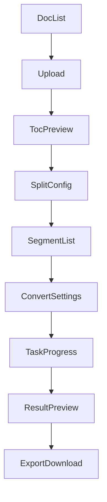
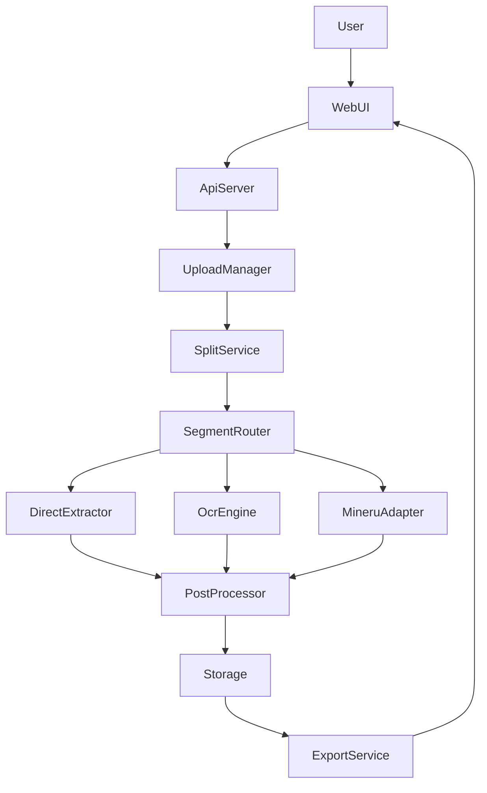

# PDF2MD 概念架构

本文件描述 pdf2md 在 **Web 形态**下的概念架构，聚焦模块职责、数据流与接口边界，不涉及具体技术选型或代码实现。

## 目标能力

- 按目录或页码范围拆书
- 对拆分段落进行 PDF → Markdown 转换（三种模式可选）
- Markdown 后处理（去页眉/页脚/噪声）
- 保存与导出

## 用户流程（Web）

### 主要页面

- **文档列表**：查看历史任务、状态、下载入口
- **上传页面**：上传 PDF 或 添加服务器指定路径+指定文件名、填写基础信息
- **拆书配置**：TOC 预览与选段；或手动页码范围拆分
- **转换设置**：对每个段落选择 Direct/OCR/MinerU
- **处理进度**：查看任务状态、失败重试、错误详情
- **结果预览**：Markdown 预览与二次处理选项
- **导出下载**：单段或整书打包导出

### 用户主流程

1. 上传 PDF → 生成 `document_id`
2. 系统读取 TOC
3. 用户选择拆分方式：
   - 有 TOC：选择章节/段落拆分
   - 无 TOC：手动输入页码范围拆分
4. 进入“段落列表”，为每个段落选择任务类型（Direct/OCR/MinerU）
5. 启动转换任务 → 进入进度页
6. 转换完成后进入结果预览 → 校验与后处理
7. 保存并导出 Markdown

### 关键交互点

- TOC 不可用时必须提示并切换到页码拆分
- 段落转换方式由用户确定，可批量设置
- 任务失败可单段重试，进度页展示失败原因



## 概念模块

1. **UploadManager**
   - 负责 PDF 上传、校验、版本管理、原始文件存储
   - 生成 `document_id`
2. **SplitService**
   - 根据 TOC 自动切分，或根据用户指定页码范围切分
   - 输出 `segment_id` 与页码区间
3. **SegmentRouter**
   - 基于段落类型或用户选择，决定采用的转换方式
   - 路由到 Direct/OCR/MinerU 三类引擎
4. **ConvertEngines**
   - **DirectExtractor**：可直接抽取文本的 PDF
   - **OcrEngine**：图片型 PDF，通过 OCR 识别
   - **MinerUAdapter**：数学或复杂版式，通过 MinerU 服务解析
5. **PostProcessor**
   - Markdown 清洗与规范化：去页眉页脚、去噪、统一格式
6. **Storage**
   - **ObjectStore**：原始 PDF、拆分 PDF、产出 Markdown
   - **MetadataStore**：文档、段落、任务状态与日志
7. **ExportService**
   - 批量下载/打包导出
   - 提供下载地址或直接下载

## 核心数据流



## 任务与状态机（概念）

在 Web 形态下建议采用异步任务执行，核心状态可参考：

- `created` → `splitting` → `segment_ready`
- `segment_ready` → `converting` → `converted`
- `converted` → `post_processing` → `done`
- 任一阶段可进入 `failed` 或 `retrying`

## 接口边界（概念级）

以下仅描述边界责任与输入输出，不规定实现协议：

1. **UploadManager**
   - 输入：PDF 文件、基础元数据
   - 输出：`document_id`、原始文件存储位置
2. **SplitService**
   - 输入：`document_id`、TOC 或页码范围
   - 输出：`segment_id` 列表、每段页码区间
3. **SegmentRouter**
   - 输入：`segment_id`、解析策略（或自动策略）
   - 输出：解析任务指派到具体引擎
4. **ConvertEngines**
   - 输入：`segment_id`、PDF 片段
   - 输出：初始 Markdown 或结构化中间产物
5. **PostProcessor**
   - 输入：Markdown
   - 输出：清洗后的 Markdown
6. **Storage / Export**
   - 输入：Markdown、任务状态
   - 输出：可下载结果或存储引用

## 关键约束与假设

- 拆分策略优先使用 TOC；无 TOC 时由用户在前端指定页码范围
- 转换方式由用户选择；若自动选择，需基于抽样检测判断
- 大文件与批量任务需要异步队列与可观测性（日志/进度/重试）
- 任何外部服务（如 MinerU）都应通过 Adapter 层隔离

## 目录建议（概念）

```
docs/
  architecture.md
```

后续若落地实现，可在 README 中链接本架构文档并补充使用流程。
